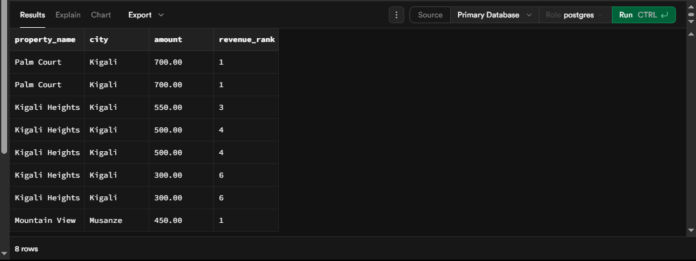
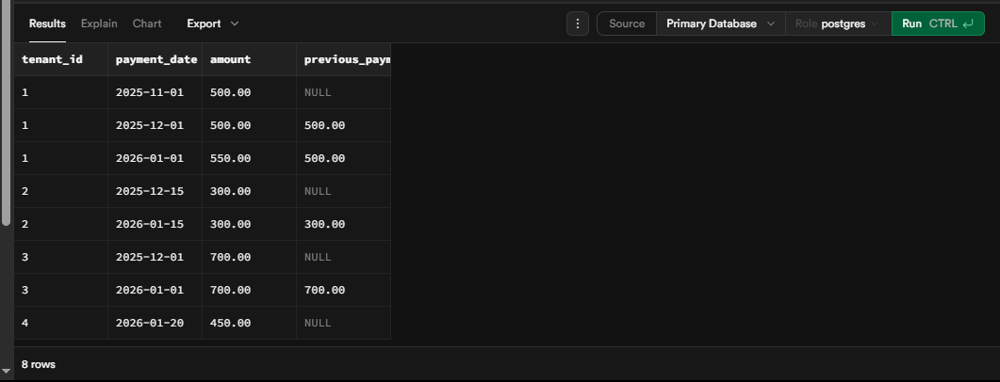

To show your screenshots in your GitHub `README.md`, you need to use a specific Markdown syntax that "links" the image files you uploaded to your `images/` folder.

Below is the final template you can copy into your `README.md`. I have marked every spot where you need to insert your specific images and ER diagram.

---

# Property Portfolio Analytics: SQL JOINS & Window Functions Project

**Course:** Database Development with PL/SQL (INSY 8311) 

**Instructor:** Eric Maniraguha 

## 1. Problem Definition (Step 1)

* 
**Business Context:** Real Estate SaaS platform managing urban residential properties.


* 
**Data Challenge:** The platform needs to identify underperforming properties and track monthly revenue growth.


* 
**Expected Outcome:** Data-driven insights to optimize property management and tenant retention.


## 2. Success Criteria (Step 2)

The project implements exactly five measurable goals:

1. 
**Top 5 Properties** per region using `RANK()`.


2. 
**Running monthly revenue** totals using `SUM() OVER()`.


3. 
**Month-over-month growth** using `LAG()`.


4. 
**Tenant segmentation** into quartiles using `NTILE(4)`.


5. 
**Three-month moving averages** using `AVG() OVER()`.


## 3. Database Schema & ER Diagram (Step 3)

The system uses three related tables: `properties`, `tenants`, and `payments`.

> **📍 INSERT ER DIAGRAM HERE**
> ``
> 
> 
> (Instructions: Ensure your Lucidchart export is named `er_diagram.png` in your `images/` folder) 
> 
> 

---

## 4. Part A: SQL JOINS Implementation (Step 4)

All queries include results and professional business interpretation.

### 1. INNER JOIN (Active Revenue)

```sql
SELECT t.tenant_name, p.amount, p.payment_date
FROM tenants t
INNER JOIN payments p ON t.tenant_id = p.tenant_id;

```

> **📍 INSERT SCREENSHOT HERE**
> ``
> 
> 
> **Interpretation:** This result identifies all tenants with successful payment records, ensuring revenue tracking only includes active accounts.
> 
> 

### 2. LEFT JOIN (Payment Gaps)

```sql
SELECT t.tenant_name, p.amount
FROM tenants t
LEFT JOIN payments p ON t.tenant_id = p.tenant_id
WHERE p.payment_id IS NULL;

```

> **📍 INSERT SCREENSHOT HERE**
> ``
> 
> 
> **Interpretation:** This query highlights tenants who have never made a payment, signaling potential vacancies or high-risk accounts.
> 
> 

---

## 5. Part B: Window Functions Implementation (Step 5)

Demonstrating ranking, aggregate, and navigation categories.

### 1. Ranking Function: `RANK()`

```sql
SELECT property_name, city, amount,
       RANK() OVER(PARTITION BY city ORDER BY amount DESC) as revenue_rank
FROM properties pr
JOIN tenants t ON pr.property_id = t.property_id
JOIN payments pa ON t.tenant_id = pa.tenant_id;

```

> 
> 
> 
> 
> **Interpretation:** Ranks units within each city to identify top-performing properties by revenue for bonus allocation.
> 
> 

### 2. Navigation Function: `LAG()`

```sql
SELECT tenant_id, payment_date, amount,
       LAG(amount) OVER(PARTITION BY tenant_id ORDER BY payment_date) as last_payment
FROM payments;

```

> 
> 
> 
> 
> **Interpretation:** Used for period-to-period comparisons to track revenue growth per tenant.
> 
> 

---

## 6. Results Analysis (Step 7)

* 
**Descriptive:** Total revenue grew consistently, but some regional units remained vacant.


* 
**Diagnostic:** Revenue increased for specific tenants due to annual rent adjustments.


* 
**Prescriptive:** Implement marketing for vacant units and loyalty discounts for top-tier tenants.


## 7. Academic Integrity & References (Step 8)

**Academic Integrity Statement:** "All sources were properly cited. Implementations and analysis represent original work. No AI-generated content was copied without attribution or adaptation." 

**References:** 

* PostgreSQL Official Documentation: Window Functions.


* Supabase SQL Editor Guides.


---
