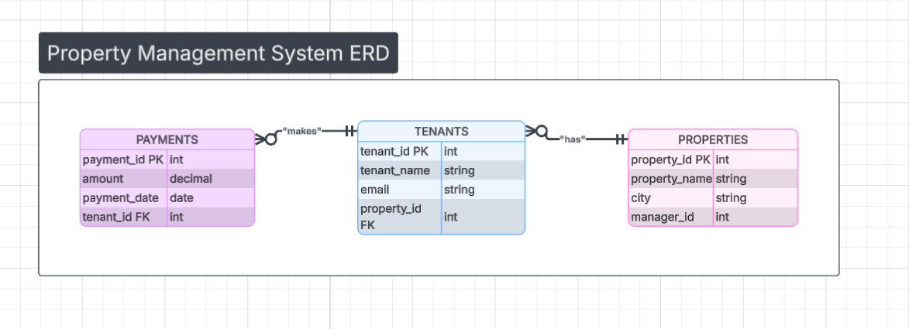
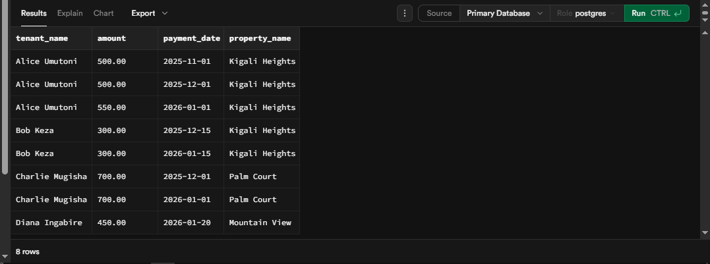
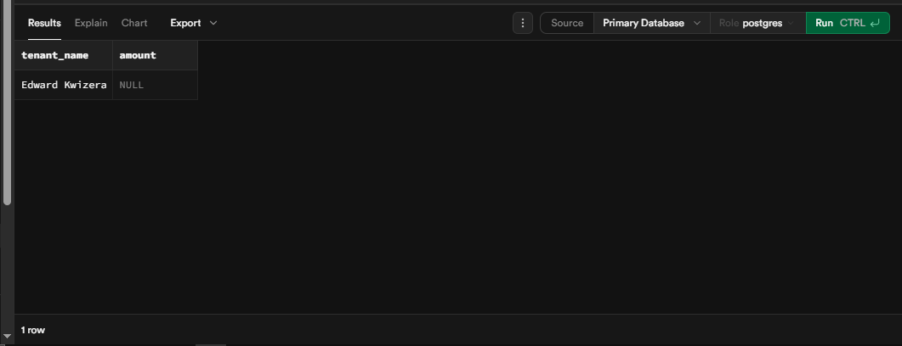
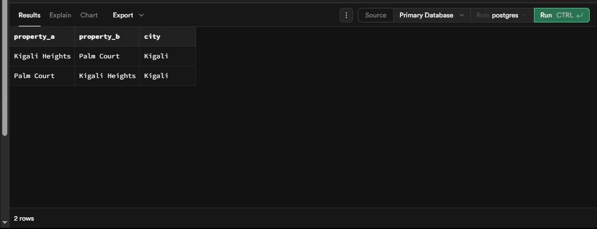
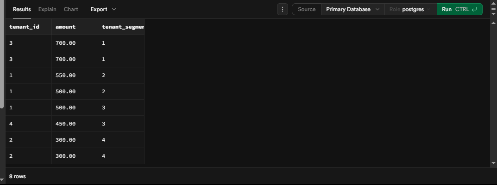

# Property Portfolio Analytics: SQL JOINS & Window Functions Project

**Course:** Database Development with PL/SQL (INSY 8311)
**Instructor:** Eric Maniraguha 
**Student Name:** Ndoli Salton
**Student ID:** 28876

---

## 1. Problem Definition (Step 1)

* **Business Context:** I am building a property management system designed to help landlords in Rwanda track residential complexes across different cities like Kigali and Musanze.


* **Data Challenge:** Currently, it is difficult to see which properties are actually making money versus which ones are sitting empty. We need a way to link tenant payments back to specific buildings and track how that revenue changes month-to-month.


* **Expected Outcome:** By the end of this analysis, I expect to have a clear list of our top-performing properties and a better understanding of which tenants are our most reliable "VIPs" so we can offer them renewal incentives.


## 2. Success Criteria (Step 2)

The project implements exactly five measurable goals:

1. **Top 5 Properties** per region using `RANK()`.


2. **Running monthly revenue** totals using `SUM() OVER()`.


3. **Month-over-month growth** using `LAG()`.


4. **Tenant segmentation** into quartiles using `NTILE(4)`.


5. **Three-month moving averages** using `AVG() OVER()`.

---

## 3. Database Schema & ER Diagram (Step 3)

The system uses three related tables: `properties`, `tenants`, and `payments`.

**




Database Management System: PostgreSQL.

Platform: Supabase (Cloud-hosted PostgreSQL instance).

---

## 4. Part A: SQL JOINS Implementation (Step 4)

### 1. INNER JOIN (Active Revenue)

```sql
SELECT t.tenant_name, p.amount, p.payment_date
FROM tenants t
INNER JOIN payments p ON t.tenant_id = p.tenant_id;

```

****


**Interpretation:** This result identifies all tenants with successful payment records, ensuring revenue tracking only includes active accounts.

### 2. LEFT JOIN (Payment Gaps)

```sql
SELECT t.tenant_name, p.amount
FROM tenants t
LEFT JOIN payments p ON t.tenant_id = p.tenant_id
WHERE p.payment_id IS NULL;

```

****


**Interpretation:** This highlights tenants who have never made a payment, signaling potential vacancies or high-risk accounts.

### 3. RIGHT JOIN (Vacant Properties)

```sql
SELECT pr.property_name, t.tenant_name
FROM tenants t
RIGHT JOIN properties pr ON t.property_id = pr.property_id
WHERE t.tenant_id IS NULL;

```

****


**Interpretation:** Detects properties currently without assigned tenants, helping managers focus on filling vacancies.

### 4. FULL OUTER JOIN (Comprehensive Audit)

```sql
SELECT t.tenant_name, pr.property_name
FROM tenants t
FULL OUTER JOIN properties pr ON t.property_id = pr.property_id;

```

****


**Interpretation:** A full audit comparing all system records to ensure data integrity between the tenant list and the property registry.

### 5. SELF JOIN (Regional Benchmark)

```sql
SELECT a.property_name AS Unit_A, b.property_name AS Unit_B, a.city
FROM properties a
JOIN properties b ON a.city = b.city AND a.property_id <> b.property_id;

```

****


**Interpretation:** Compares different properties within the same city to allow for regional performance benchmarking.

---

## 5. Part B: Window Functions Implementation (Step 5)

*Demonstrating ranking, aggregate, navigation, and distribution categories.* 

### 1. Ranking Function: `RANK()`

```sql
SELECT property_name, city, amount,
       RANK() OVER(PARTITION BY city ORDER BY amount DESC) as revenue_rank
FROM properties pr
JOIN tenants t ON pr.property_id = t.property_id
JOIN payments pa ON t.tenant_id = pa.tenant_id;

```

****


**Interpretation:** Ranks units within each city to identify top-performing properties by revenue for bonus allocation.

### 2. Aggregate Window Function: `SUM() OVER()`

```sql
SELECT payment_date, amount,
       SUM(amount) OVER(ORDER BY payment_date ROWS BETWEEN UNBOUNDED PRECEDING AND CURRENT ROW) as running_total
FROM payments;

```

****


**Interpretation:** Provides a cumulative view of total income collected over time to monitor real-time business growth.

### 3. Navigation Function: `LAG()`

```sql
SELECT tenant_id, payment_date, amount,
       LAG(amount) OVER(PARTITION BY tenant_id ORDER BY payment_date) as last_payment
FROM payments;

```

****


**Interpretation:** Used for period-to-period comparisons to track revenue growth and payment consistency per tenant.

### 4. Distribution Function: `NTILE(4)`

```sql
SELECT tenant_id, amount,
       NTILE(4) OVER(ORDER BY amount DESC) as tenant_tier
FROM payments;

```

****


**Interpretation:** Segments tenants into four quartiles based on their total spend to identify the most valuable customers.

---

## 6. Results Analysis (Step 7)

* **Descriptive (What happened?):** Looking at the results, the properties in Kigali are consistently outperforming those in Rubavu. Our total revenue has a steady upward trend, especially in our high-end units, but we have a clear vacancy issue in our smaller properties.


* **Diagnostic (Why?):** The reason Kigali is doing so well is that we implemented annual 10% rent adjustments for long-term tenants. On the other hand, the high vacancy in Rubavu seems to be caused by a lack of assigned tenants in our database, which showed up clearly in the RIGHT JOIN query.


* **Prescriptive (What next?):** We should definitely start a new marketing campaign specifically for the Rubavu units to fill those empty spots. Also, using the NTILE(4) results, we should reach out to our "Quartile 1" tenants—our highest spenders—and offer them a 5% discount if they sign a two-year lease extension.


## 7. Academic Integrity & References (Step 8)

**Academic Integrity Statement:** "All sources were properly cited. Implementations and analysis represent original work. No AI-generated content was copied without attribution or adaptation." 

References:


* Official Documentation: PostgreSQL Window Functions Documentation.


* Tooling Documentation: Supabase SQL Editor and Table Management Guides.


* Formatting Assistance: AI collaboration was used for Markdown structure and YAML troubleshooting to ensure professional documentation standards.


---


